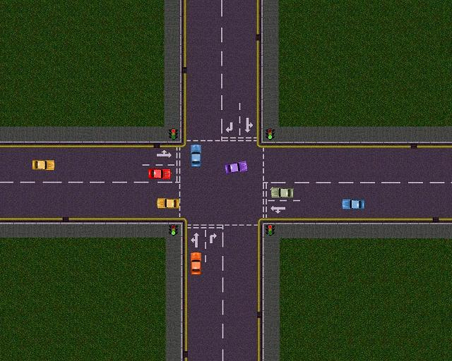

## Traffic Simulator

### Description

This is a project I was working on over a year ago, and never quite got finished. I'm uploading the best version I have, because it's a shame to let the work go to waste. The cars indicate, change lanes and start/stop at the traffic lights. Occasionally they will crash/overlap though, I could never quite fix that problem. I'll be honest, I'm in over my head with it now. Maybe someone else can finish it off. Good luck!
 
### More Info
 

             |
---                |---
**Submitted On**   |2003-10-22 23:16:46
**By**             |[Darren Hutchison](https://github.com/Planet-Source-Code/PSCIndex/blob/master/ByAuthor/darren-hutchison.md)
**Level**          |Advanced
**User Rating**    |4.7 (14 globes from 3 users)
**Compatibility**  |VB 6\.0
**Category**       |[Complete Applications](https://github.com/Planet-Source-Code/PSCIndex/blob/master/ByCategory/complete-applications__1-27.md)
**World**          |[Visual Basic](https://github.com/Planet-Source-Code/PSCIndex/blob/master/ByWorld/visual-basic.md)
**Archive File**   |[Traffic\_Si1974192172006\.zip](https://github.com/Planet-Source-Code/darren-hutchison-traffic-simulator__1-64368/archive/master.zip)

### API Declarations

Loads

